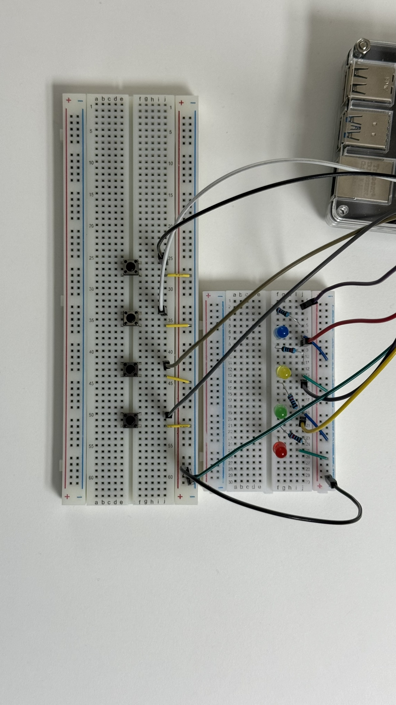

# Pi LED Game
This game gives the player a generated pattern, that the player has to repeat. Every next level the pattern increases by one led.

## PIN assignment
Button 1 : GPIO 21  
Button 2 : GPIO 20  
Button 3 : GPIO 16  
Button 4 : GPIO 26

LED 1 : GPIO 5  
LED 2 : GPIO 6  
LED 3 : GPIO 13  
LED 4 : GPIO 19

## Images

